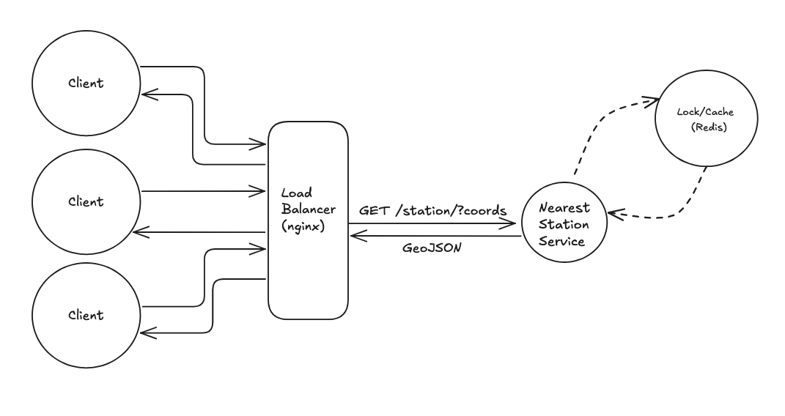
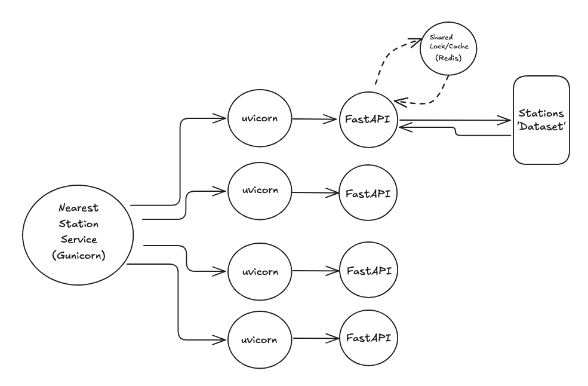
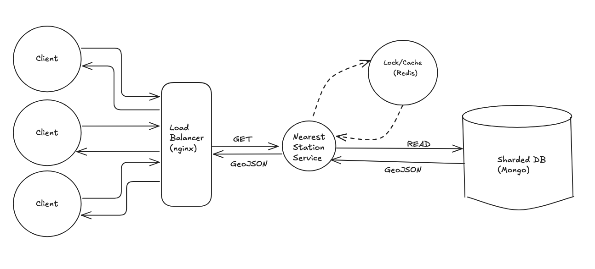

# Thoughts and Resoning 

### The following responses correspond to the items from the requirements document:
https://docs.google.com/document/d/1jbSNcx2fDihQsGnQcHbtjEr5SHmM_Bk53Qu9BmgGFDE/edit?tab=t.0

### 1. Function

First, I created two transform functions found in `transform.py`. These are `extract_to_kml` and `convert_kml`, each of which have docstrings exaplaining their functionality. In a nutshell, I needed to grab the SEPTA station information from the provided KMZ file in order to effectively calculate the neearest station. These functions are executed *at build time* when the FastAPI app is starting up. This was done so that I could avoid parsing the file on every new request. The downside here is that I have replicated the `stations` data in every FastaPI instance. A central DB would be better here. See Future Enhancements for more info.

Then, I created a function, `haversine_distance`, which takes the coordinates input by the user, and finds the closest SEPTA station. This utilizes the Haversine Formula since it's accurate enough for these purposes, and could be written without an external library (e.g. `geodesic` from `geopy`).

### 2. Endpoint Creation

I used FastAPI to create an endpoint for this function. I chose FastAPI for performance (it's fast, and asynchronous), it's Python-based nature, and speed to development. It also provided some benefits for vertical scalability (I used Gunicorn + Uvicorn to start up multiple async workers), and leveraged the `lifespan` functionality to parse the KMZ file at build time. 

### 3. Ensure no concurrent requests

To achieve this, I chose to implement a shared Redis instance. When a request is made, a lock is acquired and not released until the reuqest completes. If a separate client attempts a search for the same location (i.e. same lock key), they'll get an error response. Redis was also selected because it helped me with #4 below.

This is a little more overhead in terms of set up (and cost) but it provided a more scalable way to achieve locking. We can horizontally scale this approach, but we'd need to refactor a bit to use a different lock acquisiton method, like Redlock. But my approach is ok for a single instance proof-of-concept. 

### 4. Ensure it's cost-effective 

To me, this meant avoid extraneous calls, or calculations if we can. I leveraged my Redis instance for caching. So, when a set of coords is sent, the result is cached in Redis for a time. The benefit is that if any user now searches for that coordinate, we can just spit back an already calculated response from Redis. Using a read-through approach here because charging a user for a request, but not doing much effort on our end can maximize revenue. Further, when/if we utilize a 3rd party for directions (like Google's Routes API, say) we can cut down on costs by caching directions results in Redis.

### 5. Reurn sensible responses

This is a multi-part approach, of which I did not implement everything at the moment. Why? Because this is a proof-of-concept, and our dataset/user-base is probably very limited at the moment. 

First version, I added universally recognized JSON responses, and appropriately handled any errors the user may encounter. 

**Future:** As the data grows to encompass more regions/rails, we can add some localization here. For example, we can ensure responses are returned in an appropriate language using a request header. But, I felt this was out of scope for a limited, SEPTA dataset. 

### 6. Make single-reasonably sized instance

Enter Docker. I chose to leverage Docker to containerize the different parts of my application. This can enable us to horizontally scale our system. At the moment, you'll see three (3) replicas running. Now, our nginx instance can load balance when/if we can a massive number of requests. We can tune this as we see fit, or utilize something like kubernetes to manage scaling as needed in prod.

As well, I chose to run my FastAPI layer using gunicorn and uvicorn. Gunicorn can serve as a process manager, thus transmitting requests to any of our FastAPI instances running as async uvicorn workers.

Redis caching will help alleviate some of the load on our servers. Nginx will load balance and rate limit.

### 7. Security

Our FastAPI has some input validation; checking to validate coords comes in as a string. I've also used an nginx instance here to serve as a proxy layer. I mentioned it's load balancing responsibilites, but it also serves as a reverse proxy to protect our backend servers, and protects from attacks, like DDoS, by implementing rate-limiting. This way we have an added layer and our backend (Gunicoon) servers are oblivious to any malaicious acts. 

**Enhancements:** Authentication, and stronger CORS rules (especially when we implement some client app to show map and routes)

### 8. Metrics

Here, I'd track stuff like request throughput, errors (client and server side), cache hits, responses for our distance calc to audit accuracy, to name a few. I'd probably look to set up something like Prometheus, since it wo't block our endpoint and won't impact performance. We can set up some logic for the items we'd like to track, track them in-memory, then have Prometheus call our `/metrics` endpoint. We can also set up a Grafana instance for a dashboard to visualize metrics. 

## System Overview

### Current Overview

The below design shows the details for one intance in interest of readability. But, this is the set up for all three instances spun up via Docker.

### Nearest Station Service Detailed View

Below is a more detailed view of the "insides" of the "Nearest Service" which is what I'm calling the Gunicorn instance running various FastAPI instances via uvicorn. Each of these will hit the cache/lock and their isloated `stations` data on a cache miss.

# Future Enhancements

Some ideas that came to me for future enhancements, other than those I've mentioned, are as follows:

- A client application (React-based using something like Vite?) that enables a user to enter coordinates, or an address, and sends the request to our Nearest Servcie via our endpoint when the user submits. This would require some client-side logic to convert address to coords, or an update to the endpoint to accept an adresss and convert on the server side. Regardless, the result would be diaplyed on a map in the UI, and the user could be presented with the option to get directions. I'd call a 3rd party endpoint here, like Google Routes API, and cache the results. 

- I'm not in love with the data structure. What would be great is establishing a central data store from which our service could read. I'm thinking about using MongoDB, which would allow for GeoJSON to be stored, and we could use some geospatial queries to return the nearest station. This would remove the KMZ -> list transformation.

- Also, if we use a DB, we could leverage the fact that train stations are physically static in order to improve the efficiency of our calculation. We could check the distance to only a subset of stations by doing some geo-based sharding of our DB. So if the coords are in Philly, we only check Philly stations, not everything.

## Future Design Idea

